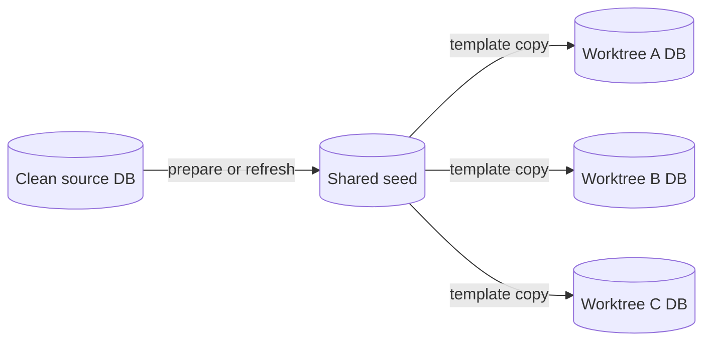

<p align="center">
  
</p>

<p align="center">
  <a href="https://github.com/tcarac/sprout/actions/workflows/go.yml"></a>
  <a href="LICENSE"></a>
  
  
</p>

Sprout pairs each Git worktree with its own PostgreSQL database. A coding agent
can start a feature, run migrations, and test against real data while other
agents work in parallel. Every worktree gets a stable database name and a local
`.sprout.env` file containing its `DATABASE_URL`.

**One source snapshot. Many independent databases. No shared migration state.**

## Why Sprout?

| Working with one development database | Working with Sprout |
| --- | --- |
| Feature migrations affect other checkouts. | Each worktree has its own database. |
| Switching branches means repairing or rebuilding local state. | Return to a worktree and pick up where you left off. |
| Parallel agents contend for the same schema and data. | Agents create and use separate databases concurrently. |

Sprout keeps one prepared seed database. New worktrees clone that idle seed
with PostgreSQL's template-copy mechanism. If the source database is busy when
the seed is built, Sprout takes a consistent `pg_dump` instead of disconnecting
the application. Refresh the seed when the clean source changes.

## Quick start

### 1. Install

You need Git, PostgreSQL 13+, Go 1.25, and `pg_dump` / `pg_restore` on `PATH`.
The PostgreSQL role must be able to read the source and create and drop
databases.

```sh
go install github.com/tcarac/sprout/cmd/sprout@latest
```

### 2. Connect your application repository

Run from its main checkout. Point Sprout at a **clean development database**:

```sh
sprout init --source-url "$DATABASE_URL"
sprout prepare

# Share the generated agent instructions with future worktrees.
git add AGENTS.md
git commit -m "Add Sprout workflow for agents"
```

`init` stores the connection URL under the repository's shared Git directory,
outside version control, with `0600` permissions. It also adds a managed
section to `AGENTS.md` and excludes `.sprout.env` in Git's shared
`info/exclude` file.

### 3. Grow a feature

```sh
sprout create feature/auth
cd ../myapp-feature-auth

export DATABASE_URL
source .sprout.env

# Run your migrations, application, and tests here.
```

`sprout create` prints the new worktree path. In a worktree created by another
tool, run `sprout ensure` to create or reuse its database. `ensure` never resets
an existing database.



## Performance

Four worktrees were created concurrently from a **26 MB PostgreSQL database
with 200,001 rows** while a connection to the source remained open:

| Copy path | Time for all four | Relative to the previous path |
| --- | ---: | ---: |
| Previous: each worktree waits, then dumps the busy source | 6.40 s | 1× |
| Sprout: prepare one seed on demand, then clone it | 1.28 s | 5× faster |
| Sprout: seed already prepared | 0.41 s | 15.6× faster |

Listing ten worktrees fell from **507 ms to 41 ms** by reading database
metadata once. These are local measurements; disk speed and database size
affect results. See the [test setup and measurements](docs/PERFORMANCE.md).

## Commands

| Command | What it does |
| --- | --- |
| `sprout create BRANCH [PATH]` | Create a feature worktree and database. |
| `sprout ensure` | Create or reuse the current worktree's database. |
| `sprout prepare` | Build the shared seed if it does not exist. |
| `sprout refresh` | Rebuild the seed from the current source for future worktrees. |
| `sprout list` | Show worktrees and database readiness. |
| `sprout env` / `sprout url` | Print the current worktree's connection details. |
| `sprout drop` | Drop only the current worktree's database. |
| `sprout remove PATH` | Remove a clean worktree and its database. |
| `sprout seed-drop` | Reclaim the seed's disk space. |
| `sprout agent-install` | Add or refresh the managed `AGENTS.md` instructions. |

`remove` refuses a worktree with uncommitted files. Sprout marks every database
it creates and checks that mark before reusing or deleting it. It does not
terminate connections to the clean source database.

The seed uses roughly one extra database's worth of disk space. Existing
worktrees keep their data after `refresh` or `seed-drop`; the next new database
rebuilds a missing seed automatically.

## Development

```sh
go test ./pkg/worktree ./cmd/sprout
go test ./... -run '^$' # compile the full project
```

The concurrent PostgreSQL integration test runs when
`SPROUT_TEST_ADMIN_URL` points at a disposable server. CI runs it with
PostgreSQL 16.

## Origin and license

Sprout includes code derived from [pgbranch by Vladyslav Len](https://github.com/le-vlad/pgbranch).
Its MIT copyright notice is retained in [LICENSE](LICENSE), and the original
project documentation is archived in [docs/PG_BRANCH_UPSTREAM.md](docs/PG_BRANCH_UPSTREAM.md).
